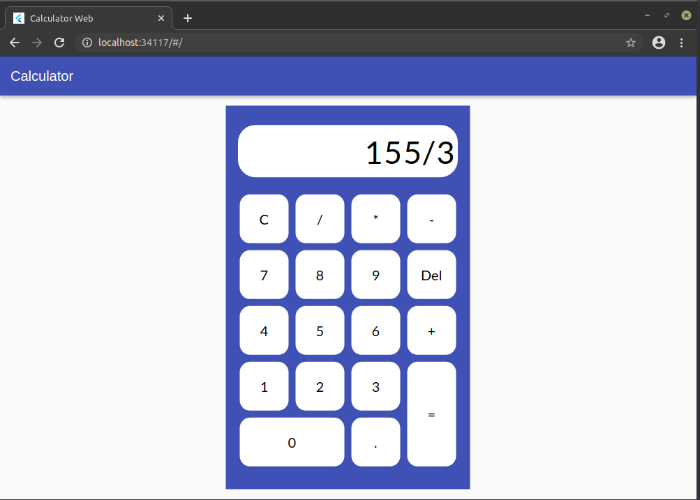
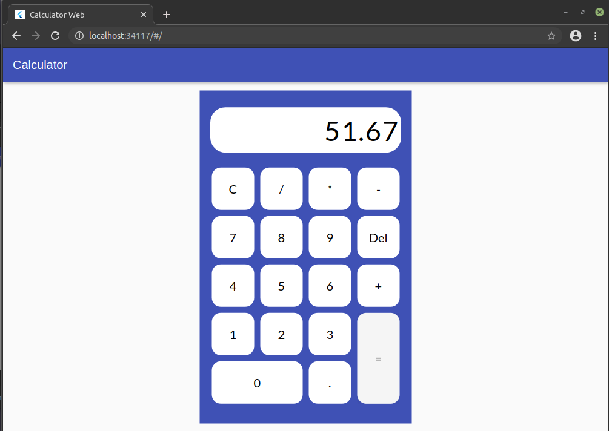

# Flutter Calculator Web App

A basic calculator example that execute math operations of two quantities. This example implements the state management 
with provider

## Constructed with 🛠️

- [Flutter](https://flutter.dev) - used Framework
- [Provider](https://pub.dev/packages/provider#-installing-tab-) - used package

## Author ✒️

- **Eduardo Coto** - creator of proyect.

## License 📄

 This project is under the License(MIT)
